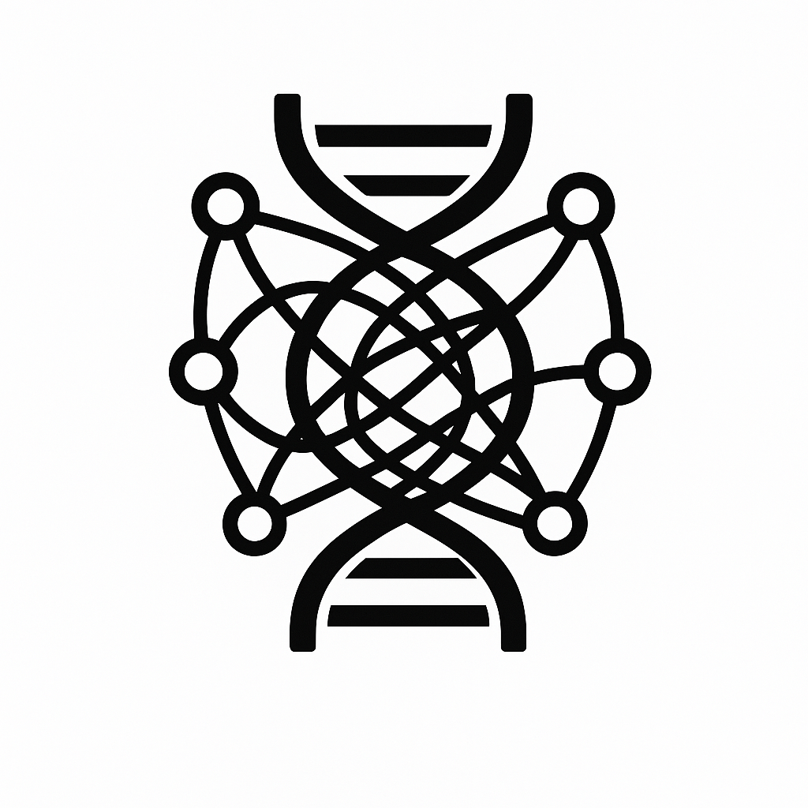

# Tangled Program Graphs

  

  <strong>A platform for developers and researchers to explore, extend, and deploy the Tangled Program Graphs reinforcement learning framework.</strong>

  <a href="#">Documentation</a>

Tangled Program Graphs (TPG) is a novel reinforcement learning framework combining the power of genetic algorithms. This organization provides the tools and resources needed to build, experiment with, and improve the TPG framework, fostering a collaborative environment for AI innovation.

## Getting Started

- 📚 Read the [Documentation]( ) for guides and tutorials

## Project Structure

- [tpg](https://github.com/TangledProgramGraphs/tpg) - C++ reinforcement learning framework at the core of TPG.
- [playground](https://github.com/TangledProgramGraphs/playground) - Interactive web platform for visualizing and experimenting with TPG agents.
- [animations](https://github.com/TangledProgramGraphs/animations) - Educational Manim animations illustrating the inner workings of the TPG framework.

## Contributing

We welcome contributions of all kinds!  We are still setting up our contribution guidelines, but stay tuned!

## About

Tangled Program Graphs is an open-source project developed by the Creative Algorithms Lab under Dr. Stephen Kelly, and the capstone group consisting of Cyruss Amante, Calvyn Siong, Mark Cruz, Edward Gao, and Richard Li.
